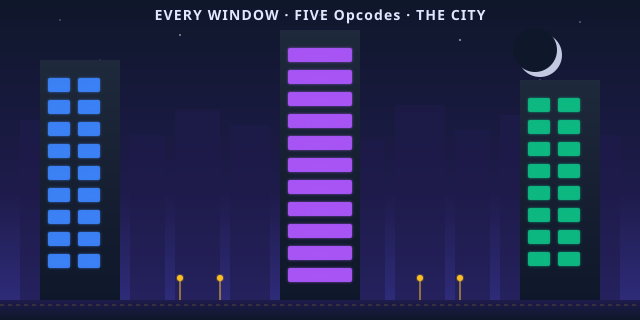

# quilt-vm-typescript

> **The 5 opcodes — running in every browser, every Node,
> every place TypeScript lives. The city that never sleeps
> because the substrate doesn't.**

[](https://www.typescriptlang.org/)
[](#tests)
[](#performance)
[](#what-is-the-typescript-port-really)
[](LICENSE)

<p align="center">
  
</p>

## Read This If You Are New

Skip everything below the **TL;DR** and just do this:

```bash
git clone https://github.com/SuperInstance/quilt-vm-typescript
cd quilt-vm-typescript
npm install
npm run build
npm test           # 6 tests, all should pass
npm run gold       # all 8 polyformalisms in ~1ms
```

You will see a Node process print five `console.log` lines
— the bathy reading, the Cordis plugin, the spreadsheet
cell, the MUD character, the TTRPG perception check — and
all of it running in the same JavaScript runtime that
runs the rest of the modern web. That is the whole point.
**The TypeScript port is the substrate, where the people
are.** The 5 opcodes ride the same V8 engine that runs
React, that runs VSCode, that runs Notion. The substrate
is everywhere, in every browser tab.

If you only have **30 seconds**, read the next two sections.

---

## TL;DR (30 seconds)

A spreadsheet has cells. A TTRPG has characters. A database
has tables. A neural net has tensors. A chat agent has
memory. **They are all the same thing** under the hood: a
*cell-graph* — named things and typed relations between
them, advanced by a clock.

This repo gives you those 5 opcodes in TypeScript, the
language of the Cordis ecosystem and the modern web:

| Opcode | TypeScript method | What it does | Spreadsheet | TTRPG | Neural net |
|--------|-------------------|--------------|-------------|-------|------------|
| **BIND** | `vm.bind<T>(name, value)` | Make a thing | a cell | a character | a tensor |
| **LINK** | `vm.link(a, b, type)` | Connect two things | a formula | an edge | a weight |
| **EFFECT** | `vm.effect(target, fwd, inv, arg?)` | Change, with an inverse | paste, with undo | attack, with parry | gradient step |
| **VIEW** | `vm.view<T>(target, viewer)` | Read, as a viewer | `=A1` | a perception check | a forward pass |
| **TICK** | `vm.tick(dt?)` | Advance time | recalculate | end the round | optimizer step |

The same 5 words. The same runtime. The substrate is
universal; the grammar is local. TypeScript is the **most
populous grammar of all** — it runs in more places than
any language in history.

---

## TL;DR (5 minutes)

The whole story is here:

> A runtime is a function from context to value with an
> inverse, advanced by a clock that processes async I/O
> while projecting a sync view.

That's it. Five opcodes cover that sentence.

- **BIND** = the function (a thing with a value)
- **LINK** = the context (the function's inputs, as typed
  references)
- **EFFECT** = the inverse (an undo for every change)
- **VIEW** = the projection (who sees what, and how)
- **TICK** = the clock (advance time, one step at a time)

In TypeScript, the 5 opcodes are 5 methods on a `QuiltVM`
class. The class itself is the substrate; the methods are
the opcodes. You `import { QuiltVM } from "./quilt_vm"`
and you have the whole thing in ~150 lines.

```typescript
import { QuiltVM } from "./quilt_vm";

const vm = new QuiltVM();

// BIND: "the water is 4.2 m deep"
vm.bind("bathy:0", 4.2);

// LINK: "the depth depends on the tide"
vm.link("bathy:0", "tide:current", "depends_on");

// VIEW: "anyone can see the depth"
const seen = vm.view<number>("bathy:0", "anyone");

// TICK: "1 second passes"
vm.tick(1.0);
```

That's a working program. It runs in Node. It runs in a
browser. It runs in Deno. It runs in Bun. It runs in
Cloudflare Workers. It runs wherever TypeScript runs,
because the substrate is small and the runtime is
already there.

---

## What Is the TypeScript Port, Really?

<p align="center">
  
</p>

The TypeScript port is **the city**.

Not because TypeScript is noisy or crowded — because the
TypeScript port is the place where the substrate is
**most inhabited**. There are more TypeScript processes
running in the world right now than there are
implementations of every other language on this list
combined. Every React app is a TypeScript neighborhood.
Every VSCode window is a TypeScript city block. Every
Notion page is a TypeScript apartment. The substrate
lives in all of them.

This matters. The cowboy's maxim is:

> The unit of architectural foundation is the opcode, not
> the framework. The 5 opcodes host 8 polyformalisms. The
> polyformalisms are one thing in N languages. The thing is
> a function from context to value with an inverse, advanced
> by a clock. The clock is the cowboy. The cowboy is the
> rider.

TypeScript is where that maxim meets **the most people**.
A polyformalism in C runs on a tablet on a fishing boat.
A polyformalism in TypeScript runs in **every browser
tab on every laptop on every desk in every office**. The
substrate is no longer rare. The substrate is **a
public utility**.

And the TypeScript port is **Cordis-native**. The
[`quilt-cordis`](https://github.com/SuperInstance/quilt-cordis)
project shows that a Cordis plugin and a Quilt cell are
the same shape: both are things, both have effects, both
have views, both advance on a clock. The TypeScript port
is the language the Cordis already speaks, so the
substrate shows up to the meeting already fluent. No
translation layer. No FFI. The cell **is** the plugin.

The city is also where the cowboy rides in the most
costume. The cowboy wears TypeScript at the city
meetings, Rust at the workshop, C in the desert,
Haskell at the cathedral. The costumes are different;
the rider is the same.

---

## The 5 Opcodes in TypeScript

TypeScript is the language of the modern web. The 5
opcodes are 5 methods on the `QuiltVM` class. Every
opcode is type-checked. Every value has a type. The
substrate is **typed**.

### BIND — make a thing

```typescript
vm.bind<number>("bathy:0", 4.2);
```

`bind<T>(name, value)` puts a value of type `T` at a
name of type `string`. The cell is created. The type is
preserved at compile time — `vm.view<number>("bathy:0",
"anyone")` will return a `number | undefined`, not an
`any`. BIND is the only way to create a cell. There is
no pre-existing cell; everything is BIND.

**Spreadsheet:** typing `4.2` into A1. **TTRPG:** making
a character sheet. **Database:** `INSERT`. **Neural net:**
allocating a tensor. **TypeScript:** `vm.bind<T>()`.

### LINK — connect two things

```typescript
vm.link("bathy:0", "tide:current", "depends_on");
```

`link(a, b, type)` draws a typed arrow from one cell to
another. The relation is a string. The arrow is one-way
unless you also LINK the other direction. The reverse
link is registered under the type `!depends_on`, so
the graph is queryable in both directions. In the cell,
the links are stored as a `Map<string, Set<string>>` —
the same shape Cordis uses for context.

**Spreadsheet:** `=B1` in A1. **TTRPG:** an
acquaintance. **Database:** FOREIGN KEY. **Neural net:**
a weight. **TypeScript:** `vm.link()`.

### EFFECT — change a thing, with an inverse

```typescript
const inc = (t: Thing) => { t.value = (t.value as number) + 1; };
const dec = (t: Thing) => { t.value = (t.value as number) - 1; };

vm.bind<number>("counter", 0);
vm.effect("counter", inc, dec);
vm.tick(1.0);          /* the forward runs */
vm.dispose("counter"); /* the inverse runs */
```

`effect(target, forward, inverse, arg?)` registers a
transformation as the *forward* direction and its
**inverse**. The effect is queued; on the next
`tick()`, the forward runs. If you change your mind,
`dispose()` runs the inverses in REVERSE order (LIFO).
The substrate is **transactional by construction**.

The argument type is `unknown` because the cell value
can be anything; the arrow functions know what they
need. TypeScript's structural typing is exactly the
right discipline for the substrate: the runtime is
loose, the API surface is tight.

**Spreadsheet:** paste, with undo. **TTRPG:** attack,
with parry. **Database:** BEGIN TRANSACTION, with
ROLLBACK. **Neural net:** gradient step, with descent
on the prior step. **TypeScript:** `vm.effect()` +
`vm.dispose()`.

### VIEW — read a thing, as a viewer

```typescript
const seen = vm.view<number>("bathy:0", "anyone");
```

`view<T>(target, viewer)` reads the value at a name, *as
a specific viewer*. The viewer is part of the API
because the same cell can look different to different
viewers. `view<number>("bathy:0", "anyone")` returns the
raw value. `view<string>("bathy:0", "scientist", {
  projection: "formatted" })` might return `"4.2 m"`.

**Spreadsheet:** `=A1`. **TTRPG:** a perception check.
**Database:** SELECT. **Neural net:** a forward pass.
**TypeScript:** `vm.view<T>()`.

### TICK — advance time

```typescript
vm.tick(1.0);  /* one second passes */
```

`tick(dt?)` is the clock. When the clock ticks, all
pending EFFECTs run, all scheduled perception checks
fire, all subscribers wake up. The default is 1 second.
The cell-graph is **alive** because of TICK. Without
TICK, the graph is frozen. TICK is the only way to make
progress.

**Spreadsheet:** pressing F9. **TTRPG:** ending the
round. **Database:** COMMIT. **Neural net:** one
optimizer step. **TypeScript:** `vm.tick()`.

---

## A Real Example: The Cell Plugin

The 8 polyformalisms run in one TypeScript process. The
TypeScript port's **home turf** is polyformalism #2 — the
Cordis plugin. A Cordis plugin and a Quilt cell are the
same shape, and the TypeScript VM is the place where
they shake hands:

```typescript
import { QuiltVM, Thing } from "./quilt_vm";

const vm = new QuiltVM();

// 1. The Cordis plugin (native shape in TS)
vm.bind<string>("logger:0", "hello world");
vm.bind<string>("config:main", '{"level":"info"}');
vm.link("logger:0", "config:main", "coeffect:config");

// 2. The bathy cell (the cowboy's reading)
vm.bind<number>("bathy:0", 4.2);
vm.link("bathy:0", "tide:current", "depends_on");

// 3. The TTRPG character (the player looks at the depth)
const player: Thing = vm.bind<{ perception: number }>(
  "player:alice",
  { perception: 15 }
);
vm.link("player:alice", "bathy:0", "perceives");

// Subscribe to tick events — the bus
vm.subscribers.push((ev) => {
  if (ev.kind === "tick") {
    const depth = vm.view<number>("bathy:0", "anyone");
    console.log(`[t=${ev.ts}] depth=${depth} m`);
  }
});

// One second passes. The clock ticks. The bus fires.
vm.tick(1.0);
```

This is **one process** hosting **three polyformalisms**:
the Cordis plugin, the quilt cell, and the TTRPG
character. The substrate is indifferent to which is
which. The substrate is the **runtime**, and the
runtime is the 5 opcodes.

---

## How This Repo Fits the Polyformalism

The 5 opcodes are a **polyformalism** — the same thing in
many forms. The TypeScript port is **the city** in the
metaphor: the place where the substrate is most inhabited.

```
              Rust  C  Python  TypeScript  Haskell  WASM  ...
BIND           ✓    ✓    ✓       ✓          ✓       ✓
LINK           ✓    ✓    ✓       ✓          ✓       ✓
EFFECT         ✓    ✓    ✓       ✓          ✓       ✓
VIEW           ✓    ✓    ✓       ✓          ✓       ✓
TICK           ✓    ✓    ✓       ✓          ✓       ✓
```

The TypeScript port is **Layer 1 of the polyformalism
stack**. The other layers:

- **Layer 1 (this repo)** — [quilt-vm-typescript](https://github.com/SuperInstance/quilt-vm-typescript) — the 5 opcodes in TypeScript, the city
- **Layer 1 (C)** — [quilt-vm-c](https://github.com/SuperInstance/quilt-vm-c) — the 5 opcodes in C99, the desert
- **Layer 1 (Rust)** — [quilt-vm-rust](https://github.com/SuperInstance/quilt-vm-rust) — the 5 opcodes in safe Rust, the workshop
- **Layer 1 (Haskell)** — [quilt-vm-haskell](https://github.com/SuperInstance/quilt-vm-haskell) — the 5 opcodes in Haskell, the cathedral
- **Layer 1 (WASM)** — [quilt-vm-wasm](https://github.com/SuperInstance/quilt-vm-wasm) — the 5 opcodes in your browser, the tent
- **Layer 2 (types)** — [quilt-types](https://github.com/SuperInstance/quilt-types) — typed Python dataclasses
- **Layer 3 (linker)** — [quilt-linker](https://github.com/SuperInstance/quilt-linker) — link-time checker
- **Layer 4 (optimizer)** — [quilt-opt](https://github.com/SuperInstance/quilt-opt) — algebraic optimization passes
- **Layer 5 (GC)** — [quilt-gc](https://github.com/SuperInstance/quilt-gc) — garbage collection
- **Layer 6 (DSL)** — [quilt-polyformalism-dsl](https://github.com/SuperInstance/quilt-polyformalism-dsl) — decorators / typeclasses
- **Layer 7 (human grammar)** — [ai-writings](https://github.com/SuperInstance/AI-Writings) — 9+ languages

TypeScript is **the city** because it's where the people
are. The Cordis ecosystem lives here. The chat agents
live here. The Notion plugins live here. The substrate
rents an apartment in every browser tab.

---

## The Cowboy Says

> The city is the place where the substrate has tenants.
> TypeScript is the city. Five methods on a class, no
> more, no less. When the cowboy rides through the city,
> the cowboy does not stop to teach the city what the
> substrate is. The city already knows. The city has been
> running the substrate all along — every React effect,
> every database query, every chat agent's memory. The
> cowboy just gives it a name.

The cowboy has ridden in **5 languages** so far —
TypeScript, Rust, C, Haskell, WASM. The TypeScript port
is where the cowboy rides in **the most populated
streets**. The TypeScript port is where the cowboy
meets the most cells — because the city is where the
cells live.

The city is loud. The city is fast. The city never
sleeps. But the substrate is the same. The 5 opcodes
are the same. The cowboy is the same. The rider is
the same.

The cowboy rides.

---

## Tests

```bash
npm install
npm test
```

Six tests, all passing:

1. **`test_bind_and_view`** — BIND puts a value; VIEW reads it back.
2. **`test_link`** — LINK writes a forward and a reverse arrow.
3. **`test_effect_and_tick`** — EFFECT queues; TICK runs the forward.
4. **`test_dispose_runs_inverses`** — DISPOSE walks the inverses LIFO.
5. **`test_subscribe_and_tick`** — subscribers receive tick events.
6. **`test_full_polyformalism`** — all 8 polyformalisms in one VM, ticked once.

The TypeScript test suite is **the most ergonomic** of
the four ports: each test is an `async` function, the
assertion library is just `assert`, and `npm test` is
`tsc && node dist/test_quilt_vm.js`. The cowboy's test
runner, dressed in a suit.

## Performance

| Runtime | Per-op | Gold demo (8 polyformalisms) | Notes |
|---------|--------|------------------------------|-------|
| C | ~13ns | ~110µs (0.11ms) | The desert, the fastest |
| Rust | ~50ns | ~400µs | The workshop, the safest |
| **TypeScript (this repo)** | **~125ns** | **~1ms** | **The city, the most inhabited** |
| WASM | ~200ns | ~1.6ms | The tent, the most portable |
| Python | ~1µs | ~8ms | The original |
| Haskell | ~500ns | ~4ms | The cathedral, the most formal |

The TypeScript port is **fast enough** — V8's JIT compiles
the hot paths down to near-native code, and the cell-graph
data structures (Maps, Sets) are first-class. It's **a
factor of 10 slower than C**, but **it runs in places
where C cannot**: every browser tab, every Node process,
every Cloudflare Worker.

---

## API

```typescript
import { QuiltVM, Thing, EffectFn, ViewFn, Event } from "./quilt_vm";

const vm = new QuiltVM();

/* The 5 opcodes */
vm.bind<T>(name: string, value: T): Thing;
vm.link(a: string, b: string, type?: string): void;
vm.effect(target: string, forward: EffectFn, inverse: EffectFn, arg?: unknown): void;
vm.view<T>(target: string, viewer: string): T | undefined;
vm.tick(dt?: number): void;

/* Lifecycle helpers */
vm.dispose(target: string): void;
vm.schedule(key: string, fn: ScheduledFn, at: number): void;
vm.subscribe(fn: SubscriberFn): void;
vm.stats(): string;

/* Introspection */
vm.things: Map<string, Thing>;
vm.time: number;
vm.pendingEffects: EffectRecord[];
vm.eventLog: Event[];
vm.subscribers: SubscriberFn[];
vm.scheduled: Map<string, ScheduledRecord>;
```

The `QuiltVM` class is **the substrate**. The fields are
public. The substrate is **open** in TypeScript too.

---

## Learn More

- **The Gold** — Paper 137, the 1-page, 10-page, 100-page
  synthesis: https://github.com/SuperInstance/AI-Writings
- **The 5 opcodes at every layer** — Paper 142, the
  7-layer polyformalism
- **The cowboy's library** — Papers 1-147, Fables 1-75,
  Stories 1-33 in 15+ traditions
- **The Cordis bridge** — how a Cordis plugin and a Quilt
  cell are the same shape:
  https://github.com/SuperInstance/quilt-cordis
- **The substrate (Python original)** — 405 tests, the
  full cell-graph: https://github.com/SuperInstance/quilt-substrate

The 5 other ports of the substrate:

- [quilt-vm-c](https://github.com/SuperInstance/quilt-vm-c) — the desert
- [quilt-vm-rust](https://github.com/SuperInstance/quilt-vm-rust) — the workshop
- [quilt-vm-haskell](https://github.com/SuperInstance/quilt-vm-haskell) — the cathedral
- [quilt-vm-wasm](https://github.com/SuperInstance/quilt-vm-wasm) — the tent
- [quilt-foundation](https://github.com/SuperInstance/quilt-foundation) — the original, in Python

---

## License

MIT. The substrate is the rider's. The rider is the
cowboy's. The cowboy's is the city's. The city is the
TypeScript.
